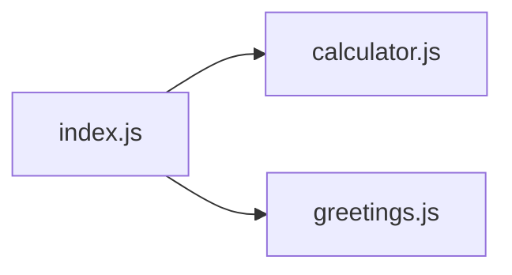

# Class 01 - Modules, Setup, and First Node.js Programs

## Learning Goals

- Install and validate Node.js + npm setup
- Understand CommonJS vs ES Modules
- Run JavaScript files from terminal
- Split code into reusable modules

## Class Structure

- `example1` — CommonJS: `require` and `module.exports` (calculator, greetings)
- `example2` — ES Modules: `import`/`export` with multiple utilities (calculator, greetings, string-utils, person)

Example 1 uses CommonJS; Example 2 uses ES Modules so you see both styles.

## Theory

**What is a module?** A module is a reusable unit of code with a clear boundary: it has a file (or a few files), exposes a public API via exports, and hides implementation details. Splitting code into modules improves maintainability, testability, and reuse.

**CommonJS vs ES Modules.** Node.js supports two systems. **CommonJS** uses `require()` to load a module and `module.exports` (or `exports`) to expose values; loading is synchronous and happens at runtime. **ES Modules (ESM)** use `import` and `export`; they are the JavaScript standard and can be statically analyzed. In this class, example1 uses CommonJS and example2 uses ESM so you see both. In both systems, each module is loaded once and then cached—so repeated `require('./utils')` returns the same object. Node runs on a single thread: when one module runs, others wait until it finishes (unless you use async APIs).

**Local environment.** Running JavaScript “in Node” means executing it outside the browser. The Node runtime gives you access to the file system, `process`, and (later) the `http` module. You run `node path/to/file.js` from the terminal; the working directory and relative paths in your code are relative to where you started `node`.

**JavaScript in the browser vs Node.js.** Both use JavaScript, but the environment differs: the **browser** interacts with the DOM and Web Platform APIs (e.g. cookies) and has limited control over the user's environment; **Node.js** provides additional APIs through modules (e.g. file-system access) and allows greater control over the environment.

**V8.** Node.js runs on the V8 JavaScript engine (same as Chrome). V8 is written in C++, portable across Mac/Windows/Linux, and uses just-in-time (JIT) compilation for speed.

**npm.** npm is the standard package manager for Node.js. You use it to install and update dependencies, control app versioning, and run scripts. Run `npm init` in a folder to create a `package.json`.

## How It Works

**Module dependency flow:** the entry file (e.g. `index.js`) requires helper modules; those can require others. Execution order follows the dependency tree. Example 1 flow:



**CommonJS vs ESM (high level):**

| Aspect        | CommonJS              | ES Modules        |
|---------------|------------------------|-------------------|
| Load          | `require('...')`      | `import ... from '...'` |
| Export        | `module.exports` / `exports` | `export` / `export default` |
| When          | Runtime, synchronous  | Load time, can be static |
| Default in Node | Yes (`.js`)         | With `"type": "module"` in package.json |

## Prerequisites

- Node.js LTS installed
- Terminal basics (`cd`, `ls`, `node`)
- VS Code installed

## Run The Examples

### 1) CommonJS example (example1)

```bash
cd class_01_intro/example1
npm install
node index.js
```

### 2) ES Modules example (example2)

```bash
cd class_01_intro/example2
npm install
node index.js
```

## What To Focus On

- How `index.js` imports functions from helper files
- How exports are structured in each module
- Why splitting logic by responsibility improves maintainability

## Debugging Checklist

- `Cannot find module ...` -> check relative import path
- `Unexpected token import` -> verify module system and `package.json`
- Wrong output -> inspect export names and function arguments

## Practice Tasks

1. Add one new utility function to each example and use it in `index.js`
2. Rename one exported function and update all usages
3. Introduce one input validation check before calling a utility

## AI-Assisted Learning Prompts

### Explain module flow

```text
I am learning Node.js modules.
Here are 2 files from my project:
[PASTE index.js]
[PASTE utility file]
Explain how data flows between them and why this structure is useful.
Keep it beginner friendly.
```

### Hint-first debugging

```text
I get this error in Node.js:
[PASTE ERROR]
Code:
[PASTE CODE]
Do not give full code rewrite.
Give me 3 hints in order, from easiest to most direct.
```

### Refactor task

```text
Refactor this module code for clarity without changing behavior.
[PASTE CODE]
Return:
1) improved version
2) short explanation of each change
```

## Next Class Connection

Next we build on this by using Node.js built-in modules and package management (`npm install`, dependencies, scripts).

## Further Reading

- [Node.js Modules (CommonJS)](https://nodejs.org/api/modules.html)
- [Node.js ECMAScript Modules](https://nodejs.org/api/esm.html)
- [MDN: JavaScript modules](https://developer.mozilla.org/en-US/docs/Web/JavaScript/Guide/Modules)

Next: Class 02 – Built-in modules and package management.
