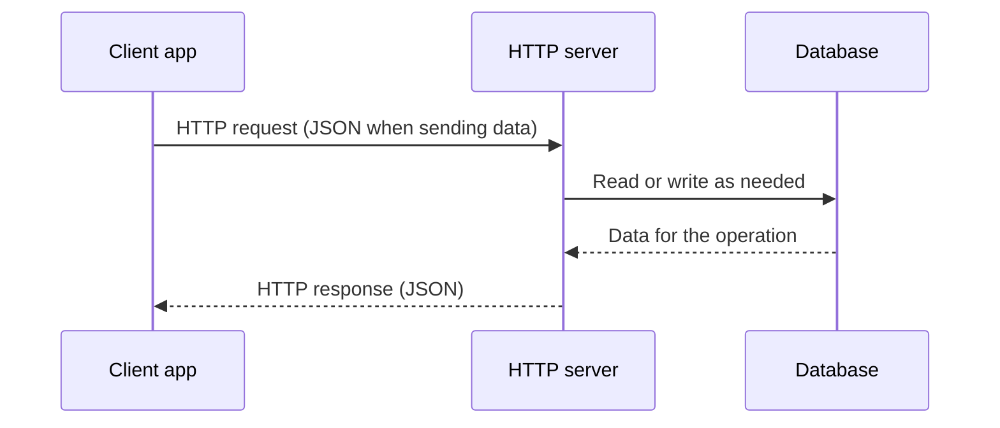
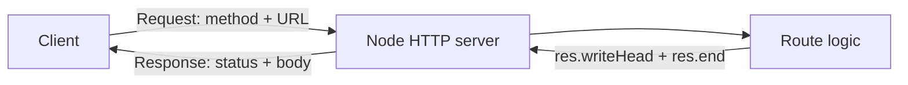
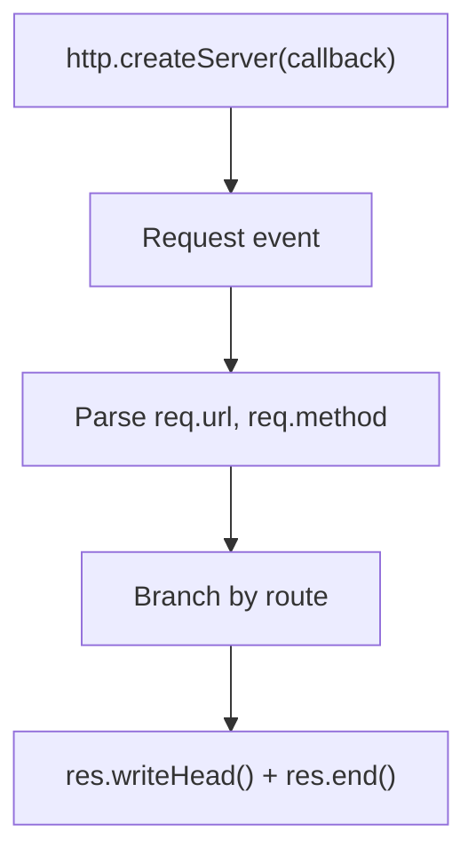

# Class 04 - HTTP Module and Basic API Servers

## Learning Goals

- Build HTTP servers using Node.js built-in `http` module (ES modules: `"type": "module"`, `import http from 'http'`)
- Match routes with `req.url` (and `req.method` when you support several verbs on one path)
- Return appropriate status codes, `Content-Type`, and bodies (plain text or JSON)
- Read a JSON POST body with `req.on('data')` / `req.on('end')`
- Try requests with the browser, **Thunder Client** (VS Code REST client), `curl`, or Postman

## Class Structure

- `**basic_example/**` — one server callback, **path-only** checks, **plain text** responses, **404** for anything else. Logs each request’s URL and method to the console.
- `**mini_app/`** — a small **JSON book API** on an in-memory array: **GET/POST** `/books`, **GET/DELETE** `/books/:id`, welcome message on **GET** `/`. Sets `**Access-Control-Allow-Origin: *`** and `**Content-Type: application/json**` for every response.

## Theory

### Big picture: client, server, and database

At a high level, the **client app** sends an **HTTP request** to the **server** (often with JSON when creating or updating data). The server runs your API logic and may **read or write** the **database**. The server then sends an **HTTP response** back (often JSON with the result or a list of records). Each interaction follows the same pattern: request out, work on the server (and sometimes the database), response back.




Client, server, and database — request and response

**HTTP basics.** HTTP is a request–response protocol: a **client** (browser, **Thunder Client**, Postman, `curl`, or another app) sends a **request** with a method (GET, POST, etc.), a URL (path + optional query string), headers, and sometimes a body. The **server** sends back a **response**: a status code, headers, and a body (e.g. JSON or HTML). The connection is stateless: the server does not remember previous requests unless you add something like cookies or tokens.

**Request structure:** HTTP method (GET, POST, etc.); path of the resource; protocol version; optional headers; optional body (e.g. for POST). **Response structure:** protocol version; status code and status message; headers; optional body. Status codes are grouped: 1xx informational, 2xx success, 3xx redirection, 4xx client error, 5xx server error.

### APIs and endpoints

An **API** (Application Programming Interface) is the **agreed way programs talk to each other**. For this class, that means: your Node server **exposes operations** over HTTP—what URLs exist, which HTTP methods are allowed, what JSON shape you send and receive, and what status codes mean. The whole collection of those rules and behaviors is the **API** of your service. Clients (browser, Thunder Client, another backend) do not need your source code; they only need to follow that contract.

An **endpoint** is **one concrete “door”** into that API: usually **one HTTP method + one path** (and sometimes query parameters). Examples from **`mini_app`**: `GET /books` (list books), `POST /books` (create a book), `GET /books/3` (one book by id), `DELETE /books/3` (remove that book). Each of those is a separate endpoint. **`basic_example`** is simpler: mostly `GET`-style paths like `/health` and `/about`—each path you handle is effectively an endpoint, even if you do not check the method yet.

**Summary:** API = the **whole** HTTP service contract; endpoint = **one** method + URL (plus how that specific call behaves). APIs are often **JSON** over HTTP, with **2xx** for success, **4xx** for client mistakes, **5xx** for server problems.

### CRUD

**CRUD** names the four usual operations on **stored data**:

| Letter | Meaning | Typical HTTP mapping (for a resource like books) |
|--------|---------|--------------------------------------------------|
| **C**reate | Add a new record | `POST` to a **collection** URL, e.g. `POST /books` with JSON body |
| **R**ead | Fetch one or many | `GET /books` (list), `GET /books/3` (one by id) |
| **U**pdate | Change an existing record | `PUT` or `PATCH` on `/books/3` with JSON body (not in **`mini_app`** yet—good exercise) |
| **D**elete | Remove a record | `DELETE /books/3` |

So **CRUD** is about *what* you do to data; HTTP methods and URLs are *how* you expose those actions in an API.

### RESTful APIs

**REST** (Representational State Transfer) is an **architectural style** for networked apps—not a single library or a strict law. People say an HTTP API is **RESTful** when it follows common REST **ideas**:

- **Resources** are things you name in URLs (`/books`, `/books/5`), not opaque RPC names like `/doSomethingWithBook`.
- **HTTP methods** carry meaning: **GET** reads (safe, no body changes on server), **POST** often creates, **PUT**/**PATCH** often update, **DELETE** removes.
- **Stateless** requests: each call should carry what the server needs (e.g. id in the URL); the server does not rely on hidden “session state” for the basic resource operations.
- **Representations**: responses are often **JSON** (or another format) describing the resource; **status codes** tell you if it worked (**200**, **201**, **404**, etc.).

No real API is “100% REST” in every academic detail; **RESTful** usually means “resource-oriented URLs + sensible verbs + JSON + clear status codes,” like **`mini_app`** for books. RPC-style or GraphQL APIs are different styles—still valid, but not what people mean by RESTful in the narrow sense.

**Node.js `http` module.** You call `http.createServer(callback)` to create a server. For each incoming request, Node invokes your callback with `(req, res)`. In `**basic_example`**, the handler uses `**request.url**` string equality for `/`, `/health`, `/about`, and `/info`. In `**mini_app**`, the handler uses `**req.method**` together with `**req.url**`, and `**url.startsWith('/books/')**` plus `**url.split('/')[2]**` to read a numeric id. You send the response with `**res.writeHead(statusCode, headers)**` (and/or `**res.setHeader**`) and `**res.end(body)**`. You must call `**res.end()**` to finish the response; otherwise the request hangs.

**Listening.** Both examples call `**server.listen(3000, 'localhost', callback)`** so the server answers at `**http://localhost:3000**`. Each `package.json` has `**npm start**` (`node index.js`) and `**npm run dev**` (nodemon).

**Status codes.** Use **200** for success, **201** for created, **400** for bad request (invalid input), **404** for not found, **500** for server error. Consistent use helps clients handle errors correctly.

## How It Works

**HTTP request/response lifecycle:** client sends request → Node server receives it → your route logic runs → you send status + body → client receives response.




**Inside the server:** one request triggers the callback; you parse URL and method, branch by route, then write status, headers, and body.




## What the examples implement

### `basic_example/`


| Path          | Response                          |
| ------------- | --------------------------------- |
| `GET /`       | `200`, plain text welcome         |
| `GET /health` | `200`, “healthy” message          |
| `GET /about`  | `200`, short about text           |
| `GET /info`   | `200`, demo / course text         |
| Anything else | `404`, plain text “not available” |


All successful routes use `**Content-Type: text/plain**`. There is **no JSON** and **no `req.method` checks**—only `**request.url`** is compared, so any verb to a matching path is treated the same.

### `mini_app/`


| Method & path       | Behavior                                                                                                                                                                                   |
| ------------------- | ------------------------------------------------------------------------------------------------------------------------------------------------------------------------------------------ |
| `GET /`             | `200`, JSON `{ message: "Welcome to our small book API!" }`                                                                                                                                |
| `GET /books`        | `200`, JSON array of books (`id`, `title`, `author`)                                                                                                                                       |
| `POST /books`       | Body must be JSON with `**title**` and `**author**`; otherwise `**400**` with `{ error: "Title or author are missing." }`. On success `**201**` and the new book (server assigns `**id**`) |
| `GET /books/:id`    | `200` and the book, or `**404**` with `{ error: "Book with ID: … not found." }`                                                                                                            |
| `DELETE /books/:id` | `**200**` and `{ message: "Successfully deleted book." }` after `**splice**` on the found index                                                                                            |
| Other routes        | `**404**`, `{ error: "Not Found" }`                                                                                                                                                        |


POST bodies are built by concatenating `**chunk.toString()**` on `**req.on('data')**`, then `**JSON.parse**` in `**req.on('end')**`.

## Run The Examples

From the repo root (adjust the path if your folder layout differs):

```bash
cd class_04_http/basic_example
npm install
npm start
```

```bash
cd class_04_http/mini_app
npm install
npm start
```

Use `**npm run dev**` if you want the server to restart on file changes (nodemon).

## Testing Workflow

In class we used **[Thunder Client](https://www.thunderclient.com/)** (VS Code / Cursor extension) to call the API, set method and URL, add JSON bodies for POST, and read status codes and responses—same idea as Postman, but inside the editor.

1. Start the server (`npm start` in the example folder).
2. `**basic_example`:** open `http://localhost:3000`, `/health`, `/about`, `/info` in the browser; try an unknown path for `404`.
3. `**mini_app`:** use the browser for GETs, or **Thunder Client** / Postman / `**curl`** for POST and DELETE (e.g. `curl -X POST http://localhost:3000/books -H "Content-Type: application/json" -d '{"title":"…","author":"…"}'`).
4. Check status code and body (plain text vs JSON) match the table above.

## What To Practice

- Mirror `**basic_example`:** add another plain-text route; keep a single `**404`** fallback.
- Mirror `**mini_app`:** add `**PUT /books/:id`** to update a book; return `**404**` when the id does not exist on DELETE (the sample always responds `**200**` after `**splice**`—think about `**findIndex === -1**`).
- Wrap `**JSON.parse**` in `**try/catch**` and return `**400**` for malformed JSON on POST.
- Use a consistent JSON shape for errors (`{ error: "…" }`) like `**mini_app**`.

**Fun idea:** Change the welcome strings and book seed data; add `**GET /api/me`** (or `**GET /me**`) that returns your name and favorite tool as JSON.

## AI-Assisted Learning Prompts

```text
I built this Node.js HTTP server:
[PASTE CODE]
Review my route handling and status codes.
Tell me any correctness issues and one improvement.
```

```text
I have this request/response bug in raw HTTP module.
Request: [METHOD + URL]
Current output: [OUTPUT]
Expected output: [EXPECTED]
Code:
[PASTE CODE]
Give minimal fix steps.
```

## Common Issues

- Missing `**res.end()**` keeps the request hanging (both examples always end the response).
- `**basic_example`:** forgetting `**return`** after `**response.end()**` can still run the `**404**` branch—use `**return**` after each handled route (as in the file).
- `**mini_app`:** POST handling is asynchronous (`**req.on('end')`**); only send the response inside `**end**` (or after you know the body is complete).
- Wrong `**Content-Type**` (e.g. plain text vs `**application/json**`) confuses clients parsing the body.
- Invalid JSON in POST body: `**JSON.parse**` throws if you do not `**try/catch**`.

## Further Reading

- [Node.js http](https://nodejs.org/api/http.html)
- [MDN: HTTP](https://developer.mozilla.org/en-US/docs/Web/HTTP), [HTTP response status codes](https://developer.mozilla.org/en-US/docs/Web/HTTP/Status)
- [RFC 7231 (HTTP/1.1)](https://datatracker.ietf.org/doc/html/rfc7231)

Next in the course, Express builds on these ideas with routers, middleware, and cleaner handlers.