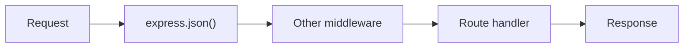
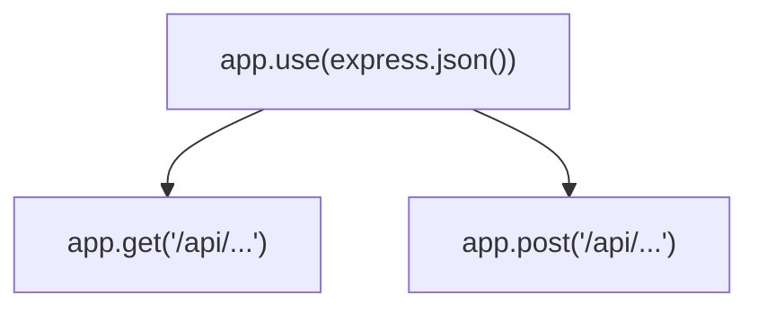

# Class 05 - Express Fundamentals

## Learning Goals

- Build APIs faster with Express
- Understand routing and middleware order
- Parse JSON requests and send structured responses
- Test routes using Postman

## Class Structure

- `example1_basic` - first Express server and routes
- `example2_mini-app` - mini API with data operations
- `homework.md` and `homework_solution`

## Theory

**Express as a framework.** Express sits on top of Node’s `http` module and gives you routing (match method + path to a handler), middleware (reusable functions that run in order), and helpers for JSON, static files, and more. You still get `req` and `res`, but with a cleaner API than manually parsing `req.url` and branching.

**Routing.** A route is the combination of an HTTP method (GET, POST, PUT, DELETE, etc.) and a path (e.g. `/api/users`). You register handlers with `app.get(path, handler)`, `app.post(path, handler)`, and so on. Express matches the incoming request to the first route that fits; you can use path parameters (`/users/:id`) and query strings. Only one route handler runs per request (unless you use `next()` to pass to the next middleware).

**Middleware.** Middleware is a function `(req, res, next) => { ... }`. It runs in the order you register it. If it doesn’t send a response, it should call **`next()`** so the next middleware or route handler runs. **`express.json()`** is built-in middleware that parses JSON request bodies into **`req.body`**; you must mount it before any route that needs `req.body`. Route handlers are middleware too; the difference is they usually send the response and don’t call `next()`.

**Router.** To group route handlers for a part of the site, create a router (e.g. in `routes/wiki.js`), define routes on it, then in the main app: `require()` the route module and call **`app.use('/path', router)`** to mount it. Express is minimal; compatible middleware packages can add auth, logging, and more.

## How It Works

**Request pipeline:** request hits the server → global middleware (e.g. `express.json()`) → route-specific middleware (if any) → route handler → response.



**Where middleware vs route sit:** body parser runs first so that route handlers can read `req.body`; then the matched route runs.



## Run The Examples

```bash
cd Class_05_Express/example1_basic
npm install
npm start
```

```bash
cd Class_05_Express/example2_mini-app
npm install
npm start
```

## Core Concepts

- Route methods: `GET`, `POST`, `PUT`, `DELETE`
- Middleware chain behavior
- Request parsing with `express.json()`
- Route-level vs global middleware

## Practice Tasks

1. Add one new CRUD route to `example2_mini-app`
2. Add validation for missing required fields
3. Add error responses with consistent shape

**Fun idea:** Add a `GET /api/me` endpoint that returns your name and favorite tool as JSON.

## AI-Assisted Learning Prompts

```text
Review this Express app:
[PASTE APP CODE]
Check middleware order and route handling.
List potential bugs from highest to lowest risk.
```

```text
I want to add a new Express endpoint:
[DESCRIBE ENDPOINT]
Current code:
[PASTE RELEVANT FILE]
Give me step-by-step implementation plan first, then code.
```

```text
Generate 6 API test cases for these routes:
[PASTE ROUTES]
Include expected status and response body checks.
```

## Common Issues

- `req.body` is `undefined` -> missing `express.json()`
- Route never hits -> wrong route path or method
- Middleware blocks response -> missing `next()` or response send

## Further Reading

- [Express.js: Hello world](https://expressjs.com/en/starter/hello-world.html), [Routing](https://expressjs.com/en/guide/routing.html), [Writing middleware](https://expressjs.com/en/guide/writing-middleware.html)

Previous: [Class 04 – HTTP](../Class_04_HTTP/README.md). Next: [Class 06 – MVC](../Class_06_MVC/README.md).
